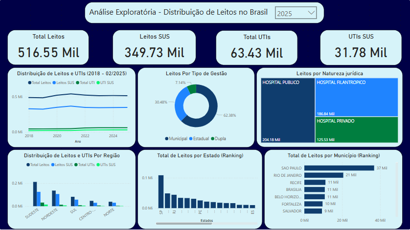

# Processamento de Dados de Leitos Hospitalares

Script Python para tratamento e consolidação de dados públicos de leitos hospitalares no Brasil (2018-2025).
Projeto feito para prática de manipulaçào de dados com python.

## 📌 Visão Geral
Projeto desenvolvido para **praticar habilidades de manipulação de dados e arquivos** em Python, com aplicação real em dados de saúde pública. O script:

- Processa arquivos CSV/Excel brutos do SUS (2018-2025)
- Aplica técnicas de limpeza, padronização e consolidação de dados
- Gera insights sobre a distribuição de leitos hospitalares
- Serve como base para dashboards analíticos

> **Objetivo de aprendizado**: praticar técnicas com Pandas, tratamento de dados inconsistentes e ETL.

## Fonte dos Dados
Portal Brasileiro de Dados Abertos e Catálogo Nacional de Dados

## Breve Análise Exploratória dos Dados 
**Screenshot do Dashboard feito no Power BI (arquivo .pbix disponível no repositório)**

[Dados Usados Aqui](https://dados.gov.br/dados/conjuntos-dados/hospitais-e-leitos)

## Pré-requisitos
- Python 3.8+
- Bibliotecas listadas em `requirements.txt`
